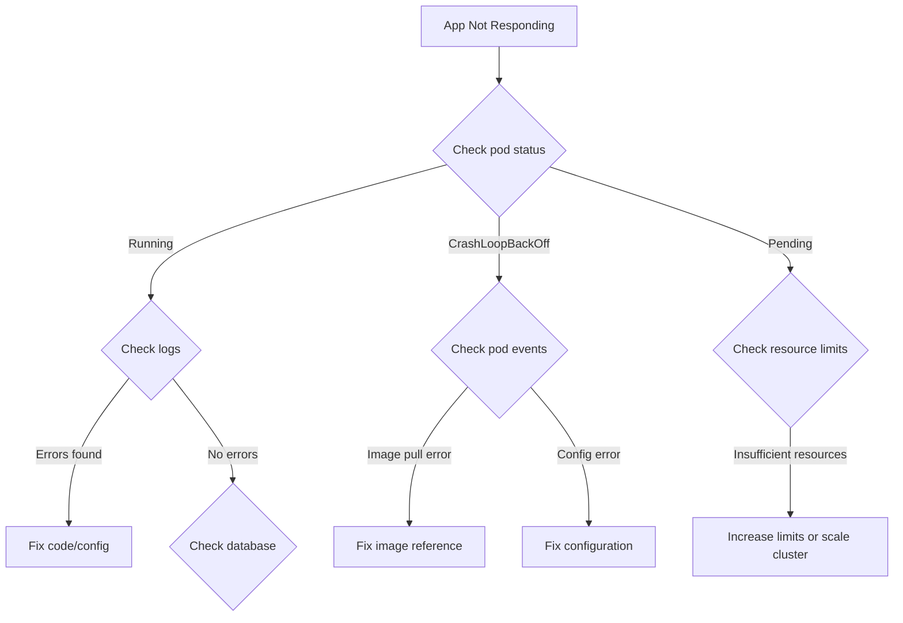

# Daily Operations Runbook

## Overview
This runbook covers routine daily operational tasks for managing the Blog platform across dev, stage, and prod environments.

## Daily Health Checks

### Morning Checklist (15 minutes)

#### 1. Check Overall Cluster Health
```bash
# Check node status
kubectl get nodes

# Expected: All nodes Ready
# NAME           STATUS   ROLES    AGE   VERSION
# master-node    Ready    control  30d   v1.28.x
# worker-node-1  Ready    worker   30d   v1.28.x
# worker-node-2  Ready    worker   30d   v1.28.x
```

#### 2. Check Namespace Health
```bash
# Check all namespaces
kubectl get pods --all-namespaces | grep -v Running

# Expected: No pods in CrashLoopBackOff, Error, or Pending states
```

#### 3. Verify Application Status

**Dev Environment:**
```bash
kubectl get pods -n dev
kubectl top pods -n dev

# Check Tailscale connectivity
curl http://blog-dev.tail-xxxxx.ts.net/api/v1/health
```

**Stage Environment:**
```bash
kubectl get pods -n stage
kubectl top pods -n stage

# Check public endpoint
curl https://stage.petedio-labs.com/api/v1/health
```

**Production Environment:**
```bash
kubectl get pods -n prod
kubectl top pods -n prod

# Check production endpoint
curl https://petedio-labs.com/api/v1/health

# Expected response:
# {
#   "status": "UP",
#   "environment": "prod",
#   "database": "connected",
#   "timestamp": "2025-XX-XX..."
# }
```

#### 4. Check ArgoCD Sync Status
```bash
# List all applications
argocd app list

# Expected: All apps "Healthy" and "Synced"
# NAME       CLUSTER                         NAMESPACE  HEALTH   STATUS
# blog-dev   https://kubernetes.default.svc  dev        Healthy  Synced
# blog-stage https://kubernetes.default.svc  stage      Healthy  Synced
# blog-prod  https://kubernetes.default.svc  prod       Healthy  Synced
```

#### 5. Review Monitoring Dashboards

Open Grafana: `https://grafana.local`

Check these dashboards:
- [ ] **Cluster Overview** - CPU, memory, disk usage
- [ ] **Application Metrics** - Error rates, response times
- [ ] **Database Dashboard** - Connections, query performance
- [ ] **Network Dashboard** - Traffic patterns, errors

Red flags to watch for:
- ⚠️ Error rate > 1%
- ⚠️ Response time p95 > 2 seconds
- ⚠️ Memory usage > 90%
- ⚠️ Disk usage > 85%
- ⚠️ Database connections > 80% of max

#### 6. Check Alert Status
```bash
# Check Prometheus alerts
kubectl port-forward -n monitoring svc/prometheus 9090:9090

# Open http://localhost:9090/alerts
# Expected: No critical alerts firing
```

Common alerts and actions:
| Alert | Severity | Action |
|-------|----------|--------|
| NodeDown | Critical | Check node status, restart if needed |
| HighMemoryUsage | Warning | Identify memory-intensive pod, consider scaling |
| PodCrashLooping | Critical | Check logs, investigate root cause |
| HighDiskUsage | Warning | Clean up old logs, expand storage |

### End of Day Checklist (10 minutes)

#### 1. Review Logs for Errors
```bash
# Check for errors in production
kubectl logs -n prod deployment/blog-api --tail=100 | grep -i error

# Check for errors in stage
kubectl logs -n stage deployment/blog-api --tail=100 | grep -i error
```

#### 2. Verify Backup Status
```bash
# Check latest database backup
kubectl exec -n prod postgres-0 -- ls -lh /backups | tail -5

# Expected: Backup from today exists
```

#### 3. Review Resource Usage Trends
```bash
# Check if any pods are consistently high on resources
kubectl top pods -n prod --sort-by=memory
kubectl top pods -n prod --sort-by=cpu
```

#### 4. Check for Pending Updates
```bash
# Check ArgoCD for out-of-sync apps
argocd app list | grep OutOfSync

# If found, investigate why sync failed
argocd app get <app-name>
```

## Weekly Tasks

### Monday Morning (30 minutes)

#### 1. Review Metrics from Previous Week
- Error rates and trends
- Traffic patterns
- Resource utilization
- Database performance

#### 2. Check for Available Updates
```bash
# Check for Kubernetes updates
kubectl version

# Check for image updates (security patches)
kubectl get pods --all-namespaces -o jsonpath='{range .items[*]}{.spec.containers[*].image}{"\n"}{end}' | sort -u
```

#### 3. Review and Update Documentation
- Update runbooks if processes changed
- Document any incidents from last week
- Update known issues list

### Friday Afternoon (15 minutes)

#### 1. Prepare for Weekend
```bash
# Ensure all critical alerts are configured
# Verify on-call rotation is up to date
# Check that automated backups are running
```

#### 2. Snapshot Key Metrics
- Note current error rates
- Document current resource usage
- Record current pod counts

#### 3. Clear Completed Alerts
- Archive resolved alerts
- Update alert thresholds if needed

## Common Operations

### Restarting a Pod

```bash
# Restart by deleting pod (deployment will recreate)
kubectl delete pod <pod-name> -n <namespace>

# Or restart entire deployment
kubectl rollout restart deployment/<deployment-name> -n <namespace>

# Monitor rollout
kubectl rollout status deployment/<deployment-name> -n <namespace>
```

### Scaling Applications

```bash
# Scale up
kubectl scale deployment/blog-api --replicas=5 -n prod

# Scale down
kubectl scale deployment/blog-api --replicas=2 -n dev

# Verify scaling
kubectl get pods -n <namespace> -l app=blog-api
```

### Viewing Logs

```bash
# Live logs from deployment
kubectl logs -f deployment/blog-api -n prod

# Logs from specific pod
kubectl logs <pod-name> -n <namespace>

# Previous instance logs (if pod restarted)
kubectl logs <pod-name> -n <namespace> --previous

# Filter logs for errors
kubectl logs deployment/blog-api -n prod | grep -i "error\|exception"

# Last 100 lines
kubectl logs deployment/blog-api -n prod --tail=100
```

### Accessing Application Shell

```bash
# Get shell in API pod
kubectl exec -it -n prod <blog-api-pod> -- /bin/bash

# Get shell in database
kubectl exec -it -n prod postgres-0 -- psql -U postgres blog_prod
```

### Checking Resource Usage

```bash
# Real-time pod resource usage
kubectl top pods -n prod

# Node resource usage
kubectl top nodes

# Detailed pod resource info
kubectl describe pod <pod-name> -n <namespace>
```

### Managing Secrets

```bash
# List secrets
kubectl get secrets -n prod

# View secret (base64 decoded)
kubectl get secret postgres-credentials -n prod -o jsonpath='{.data.POSTGRES_PASSWORD}' | base64 -d

# Update secret
kubectl create secret generic postgres-credentials \
  --from-literal=POSTGRES_PASSWORD=new-password \
  --dry-run=client -o yaml | kubectl apply -f -

# After updating secret, restart pods to pick up new values
kubectl rollout restart deployment/blog-api -n prod
```

### Investigating High Resource Usage

```bash
# 1. Identify the problematic pod
kubectl top pods -n prod --sort-by=memory

# 2. Check pod details
kubectl describe pod <pod-name> -n prod

# 3. Check logs for issues
kubectl logs <pod-name> -n prod --tail=200

# 4. Check for memory leaks via metrics
kubectl exec <pod-name> -n prod -- curl localhost:8080/actuator/metrics/jvm.memory.used

# 5. If necessary, restart pod
kubectl delete pod <pod-name> -n prod
```

## Troubleshooting Workflows

### Application Not Responding



### Database Connection Issues

```bash
# 1. Check database pod status
kubectl get pods -n prod -l app=postgres

# 2. Test database connectivity from API pod
kubectl exec -n prod <blog-api-pod> -- curl localhost:8080/api/v1/health

# 3. Check database logs
kubectl logs -n prod postgres-0 --tail=100

# 4. Check connection pool
kubectl exec -n prod postgres-0 -- psql -U postgres -c "SELECT count(*) FROM pg_stat_activity;"

# 5. Restart database if necessary (CAREFUL!)
kubectl delete pod postgres-0 -n prod
```

### High Error Rate

```bash
# 1. Check recent logs for errors
kubectl logs deployment/blog-api -n prod --tail=500 | grep -i error

# 2. Check Grafana for error patterns
# Look for specific endpoints with high error rates

# 3. Check database connectivity
kubectl exec -n prod <blog-api-pod> -- curl localhost:8080/api/v1/health

# 4. Check recent deployments
kubectl rollout history deployment/blog-api -n prod

# 5. If recent deployment caused it, rollback
kubectl rollout undo deployment/blog-api -n prod
```

## Incident Response

### Severity Levels

| Level | Description | Response Time | Examples |
|-------|-------------|---------------|----------|
| P0 - Critical | Complete outage | Immediate | Production down, data loss |
| P1 - High | Major degradation | < 15 min | High error rate, slow response |
| P2 - Medium | Partial degradation | < 1 hour | Single feature broken |
| P3 - Low | Minor issue | < 4 hours | Cosmetic bug, non-critical |

### P0/P1 Incident Response

1. **Acknowledge** (< 2 min)
   - Acknowledge alert
   - Notify team in Slack/Teams
   - Start timer

2. **Assess** (< 5 min)
   - Check health endpoints
   - Review metrics in Grafana
   - Check recent changes

3. **Mitigate** (< 15 min)
   - Rollback if recent deployment
   - Scale up if resource issue
   - Restart pods if crashed

4. **Communicate** (ongoing)
   - Update status page
   - Notify stakeholders
   - Provide ETA for fix

5. **Resolve**
   - Verify fix works
   - Monitor for 30 minutes
   - Update status page

6. **Post-Mortem** (within 48 hours)
   - Document timeline
   - Identify root cause
   - Create action items

## Useful Commands Reference

### Quick Reference Card

```bash
# Health checks
kubectl get pods -n prod
kubectl top pods -n prod
curl https://petedio-labs.com/api/v1/health

# Logs
kubectl logs -f deployment/blog-api -n prod
kubectl logs <pod-name> -n prod --previous

# Restart
kubectl rollout restart deployment/blog-api -n prod
kubectl delete pod <pod-name> -n prod

# Scale
kubectl scale deployment/blog-api --replicas=5 -n prod

# Describe
kubectl describe pod <pod-name> -n prod
kubectl describe deployment blog-api -n prod

# Events
kubectl get events -n prod --sort-by='.lastTimestamp'

# Rollback
kubectl rollout undo deployment/blog-api -n prod
kubectl rollout undo deployment/blog-api -n prod --to-revision=2

# Shell access
kubectl exec -it <pod-name> -n prod -- /bin/bash
kubectl exec -it postgres-0 -n prod -- psql -U postgres blog_prod
```

## Related Documentation
- [Monitoring & Alerts Runbook](./monitoring-alerts.md)
- [Disaster Recovery](./disaster-recovery.md)
- [Promotion Workflow](../promotion-workflow.md)
