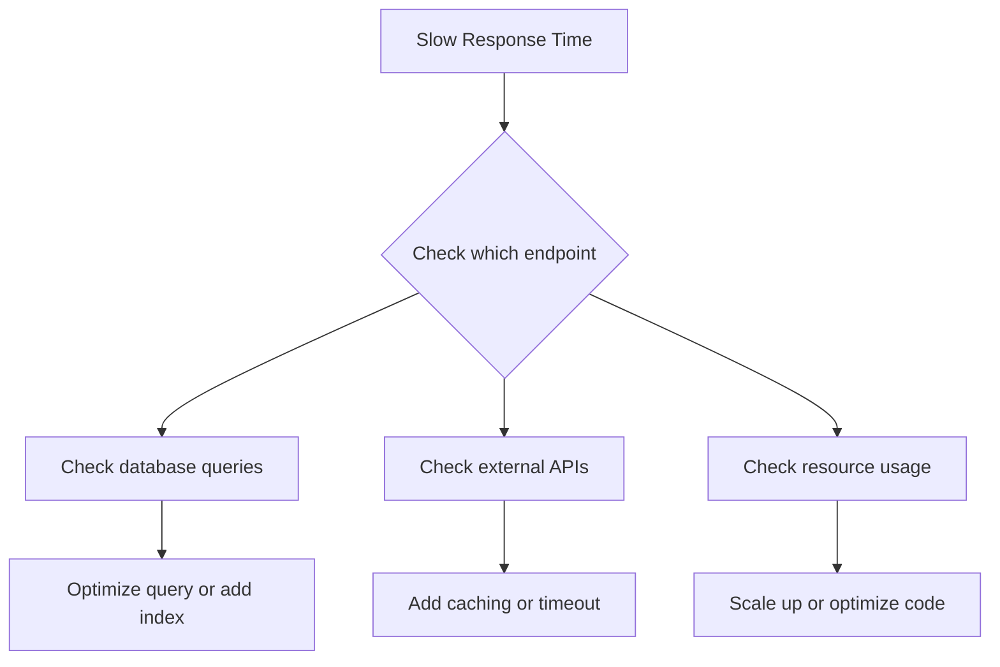

# Monitoring & Alerts Runbook

## Overview
This runbook provides detailed procedures for responding to monitoring alerts and investigating performance issues across all environments.

## Alert Categories

### Critical Alerts (P0)
Require immediate response - page on-call engineer

- NodeDown
- PodCrashLooping (production)
- DatabaseDown
- APIHighErrorRate (> 5%)
- HighDiskUsage (> 90%)

### Warning Alerts (P1)
Require investigation within 15 minutes

- HighMemoryUsage (> 90%)
- HighDiskUsage (> 85%)
- HighDatabaseConnections (> 90)
- PrometheusTargetDown

### Info Alerts (P2)
Investigate during business hours

- HighMemoryUsage (> 80%)
- ModerateErrorRate (1-5%)
- SlowResponseTime (> 2s p95)

## Alert Response Procedures

### Alert: NodeDown

**Severity:** Critical (P0)
**Trigger:** Node unreachable for > 5 minutes

#### Symptoms
- Node shows NotReady status
- Pods scheduled on node are unavailable
- Grafana shows node metrics missing

#### Investigation Steps

```bash
# 1. Check node status
kubectl get nodes

# 2. Describe the node
kubectl describe node <node-name>

# 3. Check node events
kubectl get events --all-namespaces | grep <node-name>

# 4. SSH to node (if possible)
ssh user@<node-ip>

# 5. Check system logs
journalctl -u kubelet -n 100

# 6. Check disk space
df -h

# 7. Check system resources
top
free -m
```

#### Resolution Steps

**If disk full:**
```bash
# Clean up old logs
sudo journalctl --vacuum-time=7d

# Clean up old images
docker system prune -a

# Restart node
sudo reboot
```

**If kubelet issue:**
```bash
# Restart kubelet
sudo systemctl restart kubelet

# Check status
sudo systemctl status kubelet
```

**If unrecoverable:**
```bash
# Drain node safely
kubectl drain <node-name> --ignore-daemonsets --delete-emptydir-data

# Remove from cluster
kubectl delete node <node-name>

# Provision replacement node and join cluster
# (See cluster expansion documentation)
```

---

### Alert: PodCrashLooping

**Severity:** Critical in prod, Warning in dev/stage
**Trigger:** Pod restarts > 5 times in 10 minutes

#### Symptoms
- Pod status shows CrashLoopBackOff
- Application unavailable or degraded
- Metrics show repeated pod restarts

#### Investigation Steps

```bash
# 1. Check pod status
kubectl get pods -n <namespace>

# 2. Describe the pod
kubectl describe pod <pod-name> -n <namespace>

# 3. Check current logs
kubectl logs <pod-name> -n <namespace>

# 4. Check previous logs (before crash)
kubectl logs <pod-name> -n <namespace> --previous

# 5. Check pod events
kubectl get events -n <namespace> --field-selector involvedObject.name=<pod-name>

# 6. Check resource limits
kubectl get pod <pod-name> -n <namespace> -o jsonpath='{.spec.containers[*].resources}'
```

#### Common Causes & Resolutions

**1. Configuration Error**
```bash
# Check configmap
kubectl get configmap app-config -n <namespace> -o yaml

# Verify environment variables
kubectl get pod <pod-name> -n <namespace> -o jsonpath='{.spec.containers[*].env}'

# Fix config and restart
kubectl delete pod <pod-name> -n <namespace>
```

**2. Missing Dependencies (Database)**
```bash
# Check database connectivity
kubectl exec -n <namespace> <pod-name> -- curl localhost:8080/api/v1/health

# Verify database pod is running
kubectl get pods -n <namespace> -l app=postgres

# Check database logs
kubectl logs -n <namespace> postgres-0
```

**3. Out of Memory (OOM)**
```bash
# Check if OOM killed pod
kubectl describe pod <pod-name> -n <namespace> | grep -A 5 "Last State"

# If OOMKilled, increase memory limits
kubectl set resources deployment/<deployment-name> -n <namespace> \
  --limits=memory=2Gi --requests=memory=1Gi
```

**4. Image Pull Error**
```bash
# Check image pull status
kubectl describe pod <pod-name> -n <namespace> | grep -A 10 "Events"

# Verify image exists
docker pull <image-name>

# Update image reference if needed
kubectl set image deployment/<deployment-name> -n <namespace> \
  <container-name>=<correct-image>
```

---

### Alert: HighMemoryUsage

**Severity:** Warning (P1)
**Trigger:** Pod memory usage > 90%

#### Investigation Steps

```bash
# 1. Check current memory usage
kubectl top pods -n <namespace> --sort-by=memory

# 2. Check pod resource limits
kubectl describe pod <pod-name> -n <namespace> | grep -A 5 "Limits"

# 3. Check memory metrics over time
# Open Grafana: https://grafana.local
# Navigate to "JVM Memory" dashboard

# 4. Check for memory leaks
kubectl exec <pod-name> -n <namespace> -- curl localhost:8080/actuator/metrics/jvm.memory.used

# 5. Get heap dump (Java apps)
kubectl exec <pod-name> -n <namespace> -- jmap -dump:live,format=b,file=/tmp/heap.bin 1
```

#### Resolution Steps

**Short-term fix:**
```bash
# Restart pod to reclaim memory
kubectl delete pod <pod-name> -n <namespace>
```

**Long-term fix:**
```bash
# Increase memory limits
kubectl set resources deployment/<deployment-name> -n <namespace> \
  --limits=memory=2Gi --requests=memory=1Gi

# Or enable horizontal pod autoscaling
kubectl autoscale deployment <deployment-name> -n <namespace> \
  --min=3 --max=10 --cpu-percent=70
```

**If memory leak suspected:**
1. Analyze heap dump
2. Identify leaking objects
3. Fix code and deploy

---

### Alert: HighDiskUsage

**Severity:** Warning at 85%, Critical at 90%
**Trigger:** Disk usage on node or pod > threshold

#### Investigation Steps

```bash
# 1. Check disk usage on nodes
kubectl get nodes
kubectl describe node <node-name> | grep -A 10 "Allocated resources"

# 2. SSH to node and check disk
ssh user@<node-ip>
df -h
du -sh /* | sort -rh | head -10

# 3. Check PVC usage
kubectl get pvc -n <namespace>
kubectl exec <pod-name> -n <namespace> -- df -h
```

#### Resolution Steps

**Clean up node disk:**
```bash
# Clean up old logs
sudo journalctl --vacuum-time=7d

# Clean up Docker
docker system prune -a -f

# Clean up old pods
kubectl delete pods --field-selector=status.phase!=Running -n <namespace>
```

**Clean up database disk:**
```bash
# Check database size
kubectl exec -n <namespace> postgres-0 -- psql -U postgres -c "SELECT pg_database.datname, pg_size_pretty(pg_database_size(pg_database.datname)) FROM pg_database;"

# Clean up old backups
kubectl exec -n <namespace> postgres-0 -- find /backups -mtime +30 -delete

# Vacuum database
kubectl exec -n <namespace> postgres-0 -- psql -U postgres blog_prod -c "VACUUM FULL;"
```

**Expand storage:**
```bash
# Resize PVC (if storage class supports it)
kubectl patch pvc postgres-data -n <namespace> -p '{"spec":{"resources":{"requests":{"storage":"100Gi"}}}}'

# Verify resize
kubectl get pvc postgres-data -n <namespace>
```

---

### Alert: APIHighErrorRate

**Severity:** Critical (P0)
**Trigger:** Error rate > 5% for > 2 minutes

#### Investigation Steps

```bash
# 1. Check recent logs for errors
kubectl logs deployment/blog-api -n <namespace> --tail=500 | grep -i "error\|exception"

# 2. Check specific error codes
# In Grafana, filter by status code (500, 503, etc.)

# 3. Check database connectivity
kubectl exec -n <namespace> <api-pod> -- curl localhost:8080/api/v1/health

# 4. Check recent deployments
kubectl rollout history deployment/blog-api -n <namespace>

# 5. Check resource usage
kubectl top pods -n <namespace> -l app=blog-api
```

#### Common Causes & Resolutions

**1. Recent Bad Deployment**
```bash
# Rollback to previous version
kubectl rollout undo deployment/blog-api -n <namespace>

# Monitor error rate
# Should drop within 1-2 minutes
```

**2. Database Connection Issues**
```bash
# Check database pod
kubectl get pods -n <namespace> -l app=postgres

# Check connection pool
kubectl exec -n <namespace> postgres-0 -- psql -U postgres -c "SELECT count(*) FROM pg_stat_activity;"

# If max connections reached, restart API pods to reset pool
kubectl rollout restart deployment/blog-api -n <namespace>
```

**3. External API Issues**
```bash
# Check logs for specific external API errors
kubectl logs deployment/blog-api -n <namespace> | grep -i "external\|timeout\|connection"

# If third-party API is down, implement circuit breaker or fallback
```

**4. Resource Exhaustion**
```bash
# Scale up immediately
kubectl scale deployment/blog-api -n <namespace> --replicas=5

# Check if resources are now sufficient
kubectl top pods -n <namespace>
```

---

### Alert: HighDatabaseConnections

**Severity:** Warning (P1)
**Trigger:** Active connections > 90% of max

#### Investigation Steps

```bash
# 1. Check current connections
kubectl exec -n <namespace> postgres-0 -- psql -U postgres -c "SELECT count(*) FROM pg_stat_activity;"

# 2. Check max connections
kubectl exec -n <namespace> postgres-0 -- psql -U postgres -c "SHOW max_connections;"

# 3. List connections by application
kubectl exec -n <namespace> postgres-0 -- psql -U postgres -c "SELECT application_name, count(*) FROM pg_stat_activity GROUP BY application_name;"

# 4. Check for idle connections
kubectl exec -n <namespace> postgres-0 -- psql -U postgres -c "SELECT state, count(*) FROM pg_stat_activity GROUP BY state;"

# 5. Check for long-running queries
kubectl exec -n <namespace> postgres-0 -- psql -U postgres -c "SELECT pid, now() - query_start AS duration, query FROM pg_stat_activity WHERE state = 'active' ORDER BY duration DESC;"
```

#### Resolution Steps

**Short-term:**
```bash
# Kill idle connections
kubectl exec -n <namespace> postgres-0 -- psql -U postgres -c "SELECT pg_terminate_backend(pid) FROM pg_stat_activity WHERE state = 'idle' AND state_change < NOW() - INTERVAL '5 minutes';"

# Restart API pods to reset connection pool
kubectl rollout restart deployment/blog-api -n <namespace>
```

**Long-term:**
```bash
# Increase max_connections in postgres config
kubectl exec -n <namespace> postgres-0 -- psql -U postgres -c "ALTER SYSTEM SET max_connections = 200;"

# Restart postgres
kubectl delete pod postgres-0 -n <namespace>

# Or configure connection pooling in application
# Update application.properties:
# spring.datasource.hikari.maximum-pool-size=20
# spring.datasource.hikari.minimum-idle=5
```

---

### Alert: PrometheusTargetDown

**Severity:** Warning (P1)
**Trigger:** Prometheus scrape target down > 2 minutes

#### Investigation Steps

```bash
# 1. Check Prometheus targets
kubectl port-forward -n monitoring svc/prometheus 9090:9090
# Open http://localhost:9090/targets

# 2. Identify down target
# Look for targets with "DOWN" status

# 3. Check if target pod is running
kubectl get pods -n <namespace> -l <target-label>

# 4. Check if metrics endpoint is accessible
kubectl exec -n <namespace> <pod-name> -- curl localhost:8080/actuator/prometheus

# 5. Check ServiceMonitor configuration
kubectl get servicemonitor -n <namespace>
kubectl describe servicemonitor <name> -n <namespace>
```

#### Resolution Steps

**If pod is down:**
```bash
kubectl get pods -n <namespace>
# Restart or investigate why pod is down
```

**If metrics endpoint not working:**
```bash
# Check application configuration
# Ensure Prometheus actuator is enabled in Spring Boot:
# management.endpoints.web.exposure.include=prometheus,health,info
```

**If ServiceMonitor misconfigured:**
```bash
# Edit ServiceMonitor
kubectl edit servicemonitor <name> -n <namespace>

# Verify selector matches service labels
```

## Monitoring Dashboard Guide

### Key Grafana Dashboards

#### 1. Cluster Overview
**URL:** `https://grafana.local/d/cluster-overview`

Metrics to watch:
- Node CPU usage (< 80%)
- Node memory usage (< 85%)
- Disk I/O wait (< 20%)
- Network throughput

#### 2. Application Performance
**URL:** `https://grafana.local/d/app-performance`

Metrics to watch:
- Request rate (QPS)
- Error rate (< 1%)
- Response time p50, p95, p99
- Pod count and health

#### 3. Database Performance
**URL:** `https://grafana.local/d/database-performance`

Metrics to watch:
- Active connections (< 80% of max)
- Query duration p95 (< 100ms)
- Cache hit ratio (> 90%)
- Transaction rate

#### 4. JVM Metrics (API)
**URL:** `https://grafana.local/d/jvm-metrics`

Metrics to watch:
- Heap memory usage (< 80%)
- GC pause time (< 100ms)
- Thread count
- Class loading

## Loki Log Queries

### Essential Log Queries

#### 1. Find All Errors (Last Hour)
```logql
{namespace="prod", app="blog-api"} |= "ERROR" | json
```

#### 2. Find Specific Error Type
```logql
{namespace="prod", app="blog-api"} |= "NullPointerException"
```

#### 3. Count Errors by Level
```logql
sum by (level) (count_over_time({namespace="prod", app="blog-api"} | json | level != "INFO" [1h]))
```

#### 4. Find Slow Requests (> 2s)
```logql
{namespace="prod", app="blog-api"} |= "duration" | json | duration > 2000
```

#### 5. Database Connection Errors
```logql
{namespace="prod", app="blog-api"} |~ "database|connection|postgres" |= "error"
```

#### 6. 500 Errors
```logql
{namespace="prod", app="blog-api"} | json | status_code = "500"
```

#### 7. Top Error Messages
```logql
topk(10, sum by (msg) (count_over_time({namespace="prod", app="blog-api"} |= "ERROR" | json [1h])))
```

## Performance Investigation Workflow

### When Response Time is Slow



### Investigation Steps

```bash
# 1. Identify slow endpoint
# Check Grafana "API Latency by Endpoint" dashboard

# 2. Check logs for that endpoint
kubectl logs deployment/blog-api -n prod | grep "/api/v1/<slow-endpoint>"

# 3. Check database query performance
kubectl exec -n prod postgres-0 -- psql -U postgres blog_prod -c "SELECT query, mean_exec_time FROM pg_stat_statements ORDER BY mean_exec_time DESC LIMIT 10;"

# 4. Check for N+1 queries
# Look for repeated similar queries in logs

# 5. Check if external API is slow
# Look for timeout errors in logs

# 6. Profile application
# Use Java Flight Recorder or similar
kubectl exec <pod-name> -n prod -- jcmd 1 JFR.start duration=60s filename=/tmp/recording.jfr
```

## Useful Prometheus Queries

### API Metrics

```promql
# Request rate
sum(rate(http_server_requests_seconds_count{namespace="prod"}[5m])) by (uri)

# Error rate
sum(rate(http_server_requests_seconds_count{namespace="prod",status=~"5.."}[5m])) / sum(rate(http_server_requests_seconds_count{namespace="prod"}[5m]))

# Response time p95
histogram_quantile(0.95, sum(rate(http_server_requests_seconds_bucket{namespace="prod"}[5m])) by (le, uri))

# Request count by status code
sum by (status) (rate(http_server_requests_seconds_count{namespace="prod"}[5m]))
```

### Resource Metrics

```promql
# Pod CPU usage
sum(rate(container_cpu_usage_seconds_total{namespace="prod",pod=~"blog-api.*"}[5m])) by (pod)

# Pod memory usage
sum(container_memory_working_set_bytes{namespace="prod",pod=~"blog-api.*"}) by (pod)

# Database connections
pg_stat_database_numbackends{namespace="prod"}
```

## On-Call Escalation

### Escalation Path

```
Level 1: On-call engineer (15 min response)
    ↓
Level 2: Senior engineer (30 min response)
    ↓
Level 3: Engineering lead (1 hour response)
    ↓
Level 4: CTO (only for P0 incidents)
```

### When to Escalate

- P0 incident not resolved within 30 minutes
- P1 incident not resolved within 2 hours
- Need expertise in specific domain
- Multiple simultaneous critical issues

## Related Documentation
- [Daily Operations](./daily-operations.md)
- [Disaster Recovery](./disaster-recovery.md)
- [Promotion Workflow](../promotion-workflow.md)
